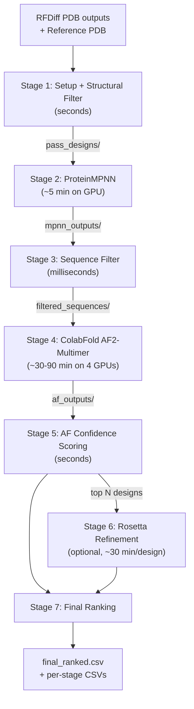

# GPCR Peptide Design Pipeline V2

## File Layout

All files live in a new directory: `final_pipeline/`

```
final_pipeline/
  config.yaml                # thresholds, weights, parameters for all stages
  run_all.py                 # unified runner (all stages, respects config.yaml)
  instructions.md            # full documentation
  stage1_setup_and_filter.py # region definition + renumber + structural filters
  stage2_mpnn.py             # ProteinMPNN sequence design
  stage3_sequence_filter.py  # post-MPNN sequence-level filters
  stage4_fold.py             # ColabFold AF2-Multimer batch runner
  stage5_af_score.py         # AF confidence metrics (iPAE, ipLDDT, iLIS, etc.)
  stage6_rosetta.py          # Rosetta refinement (optional)
  stage7_rank.py             # final composite ranking
  utils.py                   # shared helpers (PDB parsing, chain detection, etc.)
```

## Pipeline Flow




**Typical scale:** ~100-200 RFDiff designs in, ~50-100 pass Stage 1, x2-4 MPNN = ~100-400 sequences, sequence filter flags ~10-20%, AF2 on ~100-350, Rosetta on top ~10%.

---

## Stage 1: Setup + Structural Filters

**File:** `stage1_setup_and_filter.py`

**Inputs:**

- Reference PDB (cryo-EM / crystal complex)
- RFDiffusion design PDBs (backbone + side chains, 2-chain: receptor + peptide)
- `--receptor-chain`, `--peptide-chain` (or auto-detect)
- `--hotspot-residues` (comma-separated resnums, optional)
- Thresholds from config.yaml or CLI overrides

**Outputs (all written to `<outdir>/`):**

- `regions.json` -- pocket, head, hotspot definitions + pocket center + depth axis
- `renumbered/` -- renumbered PDB files
- `pass_designs/` -- copies of renumbered PDBs that passed all filters
- `stage1_summary.csv` -- per-design metrics + pass/fail columns

**What this stage does:**

1. Define regions from reference (pocket, head, hotspots, pocket geometry)
2. Renumber each design to match reference numbering
3. Score each renumbered design against structural criteria
4. Copy passing designs to `pass_designs/`

### Metrics

`**n_head_in_pocket`** -- Number of peptide "head" residues (reference-derived interface residues) that contact at least one receptor pocket residue within the contact cutoff.

- *Why effective:* Directly measures whether the peptide's key interacting segment is engaging the binding site. Peptides bind through a small number of critical anchor residues; this counts how many are positioned correctly.
- *Threshold:* `>= 2` (default). Hard filter.

`**n_head_pocket_pairs`** -- Total count of (head residue, pocket residue) pairs within contact distance.

- *Why effective:* A richer measure than n_head_in_pocket. More pairs = more distributed interface, which correlates with binding stability. Single-contact designs are fragile.
- *Threshold:* `>= 4` (default). Hard filter.

`**min_head_pocket_dist`** -- Closest heavy-atom distance across all head-pocket residue pairs (Angstroms).

- *Why effective:* Sanity check that the peptide actually makes close contact. Very large values indicate the peptide drifted away.
- *Threshold:* No hard filter; informational.

`**n_clashes_severe`** -- Number of inter-chain heavy-atom pairs closer than 1.8 A.

- *Why effective:* Severe steric clashes indicate physically impossible conformations. RFDiffusion occasionally produces backbone poses with atom overlaps.
- *Threshold:* `== 0` (default). Hard filter.

`**n_clashes_mild`** -- Number of inter-chain heavy-atom pairs closer than 2.1 A.

- *Why effective:* Mild clashes suggest overly tight packing that would cause strain. A few are tolerable (side-chain rotamer sampling can resolve them), but too many indicate a bad pose.
- *Threshold:* `<= 5` (default). Hard filter.

`**n_hotspot_contacts`** -- Number of user-specified hotspot residues contacted by the peptide (within contact cutoff).

- *Why effective:* Hotspot residues are experimentally or computationally known to drive binding (e.g., from alanine scanning, GPCRdb conserved positions). Designs missing these contacts are unlikely to bind. For GPCRs, orthosteric pocket residues are well-characterized.
- *Threshold:* `>= 1` (default). Hard filter. Set to 0 or flag-only if hotspots are uncertain.
- *If no hotspots specified:* This metric is skipped.

`**peptide_pocket_dist`** -- Euclidean distance from peptide CA centroid to the pocket geometric center (Angstroms).

- *Why effective:* Catches designs where the peptide sits on the receptor surface far from the intended binding pocket. Especially important for GPCRs where the peptide should be in the orthosteric pocket, not on the extracellular domain surface.
- *Threshold:* `<= 15.0 A` (default). Flag-only by default.
- *Computation:* Pocket center = mean of CA atoms of all pocket residues. Peptide centroid = mean of all peptide CA atoms.

### Config section

```yaml
stage1:
  pocket_cutoff: 6.0           # A, receptor residues near peptide
  head_cutoff: 5.0             # A, peptide residues near pocket
  contact_cutoff: 5.0          # A, for counting contacts
  hotspot_residues: []         # list of receptor resnums, or empty for none
  severe_clash_cutoff: 1.8
  mild_clash_cutoff: 2.1
  thresholds:
    min_head_in_pocket: { value: 2, mode: filter }
    min_head_pocket_pairs: { value: 4, mode: filter }
    max_severe_clashes: { value: 0, mode: filter }
    max_mild_clashes: { value: 5, mode: filter }
    min_hotspot_contacts: { value: 1, mode: filter }
    max_peptide_pocket_dist: { value: 15.0, mode: flag }
```

Each threshold has `mode: filter` (hard cutoff, design excluded if fails) or `mode: flag` (warning column in CSV, design kept). Mode can be set to `ignore` to skip entirely.

**Runtime:** ~1-3 seconds per design. 200 designs = ~5 min.

---

## Stage 2: ProteinMPNN Sequence Design

**File:** `stage2_mpnn.py`

**Inputs:**

- `pass_designs/` directory from Stage 1 (renumbered PDBs that passed)
- `regions.json` from Stage 1 (to know which chains are receptor vs peptide)
- `--num-seq-per-target` (default: 4, configurable)
- `--sampling-temp` (default: 0.1)
- Path to ProteinMPNN installation (default: `/orcd/data/zhang_f/001/azong/software/ProteinMPNN`)

**Outputs (all in `<outdir>/`):**

- `parsed_pdbs.jsonl` -- parsed chain coordinates
- `fixed_chains.jsonl` -- chain design/fix assignments
- `mpnn_outputs/seqs/*.fa` -- FASTA files with designed sequences + scores
- `stage2_summary.csv` -- design name, MPNN sample index, sequence, MPNN score

**What this stage does:**

1. Calls `parse_multiple_chains.py` on `pass_designs/`
2. Calls `assign_fixed_chains.py` to fix the receptor chain, design the peptide chain
3. Calls `protein_mpnn_run.py` with configured parameters
4. Parses output FASTAs into a summary CSV

**Key parameter: `num_seq_per_target`**

- Controls how many different peptide sequences MPNN generates per backbone.
- More sequences = more diversity but more AF2 compute downstream.
- Recommendation: 2-4 for production runs. Each additional sequence adds ~30-90 sec of AF2 time.

**Runtime:** ~5-10 seconds per design on GPU (L40S). 100 designs = ~10-15 min. With `batch_size = num_seq_per_target`, all sequences for one design are generated in a single GPU pass.

### Config section

```yaml
stage2:
  mpnn_path: /orcd/data/zhang_f/001/azong/software/ProteinMPNN
  num_seq_per_target: 4
  sampling_temp: "0.1"
  batch_size: 4   # should be <= num_seq_per_target
```

---

## Stage 3: Sequence Filters

**File:** `stage3_sequence_filter.py`

**Inputs:**

- MPNN FASTA outputs from Stage 2 (`mpnn_outputs/seqs/*.fa`)
- Config thresholds

**Outputs:**

- `stage3_summary.csv` -- per-(design, sample) metrics + pass/flag columns
- `filtered_sequences/` -- FASTA files of sequences that passed (input for Stage 4)

**What this stage does:**
Parse MPNN output FASTAs, compute sequence-level heuristics, filter or flag.

### Metrics

`**mpnn_score`** -- ProteinMPNN's negative log-likelihood for the designed sequence given the backbone structure. Extracted from FASTA header.

- *Why effective:* Lower score = MPNN is more confident the sequence folds into the given backbone. Scores above ~3.0 indicate the backbone is difficult to design for, suggesting structural issues. For peptides, this primarily reflects how well the peptide sequence fits the designed backbone conformation.
- *Threshold:* `<= 2.5` (default). Hard filter.

`**net_charge`** -- Net charge at pH 7. Computed as: count(K, R) + 0.1*count(H) - count(D, E).

- *Why effective:* Extreme net charge (|charge| > 5 for a ~30-residue peptide) can cause solubility issues, nonspecific electrostatic binding, or poor cell penetration. Standard pharmaceutical peptides tend to be near-neutral.
- *Threshold:* `|net_charge| <= 5` (default). Flag-only.

`**hydrophobic_fraction`** -- Fraction of residues that are hydrophobic (A, V, L, I, M, F, W, P).

- *Why effective:* Excessively hydrophobic peptides aggregate in solution and may bind nonspecifically to membranes rather than the target pocket. For GPCR peptide ligands, a moderate hydrophobic fraction is expected (native GLP-1 is ~40% hydrophobic), but > 60% is a red flag.
- *Threshold:* `<= 0.60` (default). Flag-only.

### Config section

```yaml
stage3:
  thresholds:
    max_mpnn_score: { value: 2.5, mode: filter }
    max_abs_net_charge: { value: 5, mode: flag }
    max_hydrophobic_fraction: { value: 0.60, mode: flag }
```

**Runtime:** Milliseconds for any number of sequences.

---

## Stage 4: ColabFold AF2-Multimer Folding

**File:** `stage4_fold.py`

**Inputs:**

- Filtered sequences from Stage 3 (`filtered_sequences/`)
- Receptor sequence (extracted from reference PDB or provided directly)
- `regions.json` (for chain mapping)
- Pre-computed MSA directory (cached, or generated on first run)

**Outputs:**

- `af_outputs/<design_name>/` -- per-design directories containing:
  - `*_unrelaxed_rank_*.pdb` -- predicted structures (5 model seeds)
  - `*_scores_rank_*.json` -- confidence data (pLDDT, PAE, pTM, ipTM)
  - `*_pae_rank_*.json` -- PAE matrices (if separate)
- `stage4_summary.csv` -- design name, fold status, timing

### How ColabFold Works

ColabFold is a local, open-source implementation of AlphaFold2 that replaces the expensive HHblits/JackHMMER MSA search with the much faster MMseqs2. For multimer prediction, it uses the AF2-Multimer model weights.

**Why AF2-Multimer instead of AF3:** Research (Holcomb et al. 2025, "Deep learning in GPCR drug discovery") found that AF2 produces more reliable peptide-GPCR binding modes than AF3, likely because AF2-Multimer was specifically trained on protein complex structures. AF3's diffusion-based architecture sometimes produces unrealistic peptide conformations.

**MSA Reuse Strategy (key speed optimization):**

The receptor sequence is the same across all designs; only the peptide changes. MSA search is the slowest part (~5-15 min). Strategy:

1. **One-time:** Run `colabfold_search` on the receptor sequence alone against the ColabFold database. This produces `.a3m` MSA files. Cache in `msa_cache/`.
2. **Per-design:** Construct a paired FASTA with `receptor_seq:peptide_seq`. Point ColabFold to the cached receptor MSA. Peptide MSAs are trivial (short, few homologs) and computed quickly.
3. **Result:** Each fold takes ~30-90 sec per model seed instead of ~10-20 min.

**Multi-GPU Parallelization:**

- `stage4_fold.py` generates a SLURM array job script.
- Designs are split across N GPUs (default: 4).
- Each GPU runs an independent `colabfold_batch` process on its subset.
- Example: 200 sequences / 4 GPUs = 50 per GPU. At ~3-5 min per design (5 seeds) = ~2.5-4 hours per GPU.
- With 4 GPUs running in parallel: **~2.5-4 hours total.**

**ColabFold Output Format vs AF Web Server:**
ColabFold outputs are structured differently from AF web server ZIPs:

- Web server: single ZIP with `*_full_data_*.json`, `*_model_*.cif`, `*_summary_confidences_*.json`
- ColabFold: directory with `*_unrelaxed_rank_*.pdb`, `*_scores_rank_*.json`, `*_pae_rank_*.json` (or combined)

Stage 5 will include format detection to handle both. This means you can also feed in AF web server ZIPs if you fold manually.

### Config section

```yaml
stage4:
  colabfold_bin: colabfold_batch   # or full path
  msa_cache_dir: msa_cache/
  num_models: 5
  num_recycles: 3
  num_gpus: 4
  slurm_partition: mit_preemptable
  slurm_time: "04:00:00"
  slurm_mem: 64G
```

### ColabFold Installation (to be done interactively)

- Install via conda: `conda create -n colabfold -c conda-forge -c bioconda colabfold`
- Download model weights and MMseqs2 databases
- Test with a single small fold
- Discuss version, database location, and GPU compatibility with user during setup

---

## Stage 5: AF Confidence Scoring

**File:** `stage5_af_score.py`

**Inputs:**

- AF outputs from Stage 4 (ColabFold directories OR AF web server ZIPs)
- `regions.json` from Stage 1 (pocket/head/hotspot definitions, pocket center, depth axis)
- Receptor sequence (for DeepTMHMM topology prediction, cached)

**Outputs:**

- `stage5_scores.csv` -- per-(design, model_seed) raw metrics
- `stage5_aggregated.csv` -- per-design aggregated metrics (median - MAD across seeds)

### Format Adapter

Auto-detects input format:

- If input path is a `.zip` file: parse as AF web server format (CIF + JSON)
- If input path is a directory: parse as ColabFold format (PDB + JSON)
- Both normalized to: `(structure, pae_matrix, plddt_array, summary_dict)` per model seed

### Metrics Per Model Seed

`**ipTM`** -- Interface predicted TM-score. Pre-computed by AF, extracted from summary JSON.

- *Why effective:* Measures how confidently AF predicts the relative orientation of the two chains. Higher ipTM = AF is more certain the peptide-receptor interface is correct. The single best global interface confidence metric from AF-Multimer. However, for peptides it can be diluted by disordered tails (short peptide with a floppy terminus drags down the global score).
- *Threshold:* `>= 0.5` (default). Hard filter.

`**iPAE`** -- Median predicted aligned error (PAE) over interface residue pairs (Angstroms). Interface = peptide-receptor residue pairs with any heavy-atom distance < 5A in the AF model.

- *Why effective:* PAE measures AF's confidence in the relative position of two residues. By restricting to interface residues and using median (not mean), this metric avoids dilution from disordered tails -- a critical issue for peptides where 30-50% of residues may be unstructured. Lower iPAE = AF is more confident about the binding pose. This is the single most important metric for peptide-receptor predictions.
- *Computation:* Find interface pairs (peptide res i, receptor res j with heavy-atom dist < 5A). Take median of PAE[tok_i, tok_j] over all such pairs (A->B direction), then average with B->A direction for symmetry.
- *Threshold:* `<= 10.0 A` (default). Hard filter.

`**ipLDDT`** -- Median pLDDT of peptide residues participating in the interface.

- *Why effective:* pLDDT measures per-residue confidence in the local structure. For peptides, the tail residues often have low pLDDT (< 50) because they are genuinely disordered, which drags down global metrics. By restricting to interface residues, ipLDDT measures whether AF is confident about the peptide's conformation specifically at the binding site. This distinguishes "peptide binds well but has a floppy tail" (good) from "peptide is poorly positioned everywhere" (bad).
- *Computation:* Identify peptide residues with at least one receptor contact within 5A. Take median of their pLDDT values (from B-factor column in CIF/PDB).
- *Threshold:* `>= 70` (default). Hard filter.

`**iLIS`** (Local Interaction Score) -- Fraction of interface residue pairs that are both structurally close AND confidently predicted.

- *Why effective:* Inspired by AFM-LIS (Wallner 2023). Standard interface metrics average over all contacts, but many peptide-receptor contacts are weak or uncertain. iLIS specifically counts only the "confident sub-interface" -- pairs where AF places them close (CB distance <= 8A) AND is confident about their relative position (PAE <= 12A). A high iLIS means a large fraction of the interface is trustworthy. This is the best metric for flexible/disordered interfaces like peptide-GPCR binding.
- *Computation:*

```
  interface_pairs = {(i,j) : heavy_atom_dist(i,j) < 5A, i in peptide, j in receptor}
  confident_pairs = {(i,j) in interface_pairs : CB_dist(i,j) <= 8A AND PAE(i,j) <= 12A}
  iLIS = len(confident_pairs) / len(interface_pairs)
  

```

  Use CA instead of CB for glycine residues.

- *Threshold:* `>= 0.20` (default). Hard filter.

`**pocket_depth`** -- How deep the peptide penetrates into the receptor pocket (Angstroms).

- *Why effective:* For GPCRs, native peptide ligands insert deeply into the orthosteric pocket (transmembrane bundle). Designs that only make surface contacts are unlikely to activate the receptor. Depth correlates with binding affinity for orthosteric GPCR ligands.
- *Computation:* Project each peptide heavy atom onto the depth axis (from `regions.json`: normalized vector from receptor centroid toward pocket center). `pocket_depth = max(projections)`. Higher = deeper insertion.
- *Threshold:* `>= 0` (default, flag-only). Tune based on reference peptide depth.

`**topo_pass`** -- Does the peptide contact extracellular receptor residues?

- *Why effective:* GPCRs have 7 transmembrane helices with intracellular and extracellular faces. Peptide ligands bind the extracellular/orthosteric face. AF sometimes produces models where the peptide contacts the intracellular side, which is biologically implausible. DeepTMHMM predicts transmembrane topology from sequence alone, letting us flag these.
- *Computation:* Run DeepTMHMM on receptor sequence (once, cached). For each design, count how many peptide-contacting receptor residues are classified as extracellular. `topo_pass = (n_extracellular_contacts > 0)`.
- *DeepTMHMM runtime:* ~10-30 seconds, once per receptor (not per design). Negligible cost.
- *Threshold:* `topo_pass == True` (default). Flag-only.

### Model Seed Aggregation

For each metric across 5 AF model seeds, compute a "pessimistic aggregate" that rewards consistency:

```
x_tilde = median(x_m for m in seeds)
MAD = median(|x_m - x_tilde| for m in seeds)
```

For "higher is better" metrics (ipTM, ipLDDT, iLIS, pocket_depth):

```
x_star = x_tilde - MAD
```

For "lower is better" metrics (iPAE):

```
x_star = x_tilde + MAD
```

This penalizes designs where AF gives inconsistent predictions across seeds.

### Config section

```yaml
stage5:
  contact_cutoff: 5.0
  cb_cutoff_ilis: 8.0
  pae_cutoff_ilis: 12.0
  use_deeptmhmm: true
  thresholds:
    min_ipTM: { value: 0.5, mode: filter }
    max_iPAE: { value: 10.0, mode: filter }
    min_ipLDDT: { value: 70, mode: filter }
    min_iLIS: { value: 0.20, mode: filter }
    min_pocket_depth: { value: 0, mode: flag }
    require_topo_pass: { value: true, mode: flag }
```

**Runtime:** ~2-5 seconds per design per model seed. 200 designs x 5 seeds = ~30 seconds total.

---

## Stage 6: Rosetta Refinement (OPTIONAL)

**File:** `stage6_rosetta.py`

**Enabled/disabled via config:** `stage6.enabled: false` (default).

**Inputs:**

- Top N% of designs from Stage 5 (ranked by AF composite score)
- AF-predicted structures (PDB format; CIF auto-converted to PDB)
- Rosetta installation path

**Outputs:**

- `rosetta_outputs/` -- relaxed PDBs
- `rosetta_scores/` -- InterfaceAnalyzer `.sc` files
- `stage6_scores.csv` -- parsed Rosetta metrics

### What this stage does

1. Convert AF CIF outputs to PDB format (if needed)
2. Thread MPNN-designed sequences onto AF structures (if not already threaded)
3. Run Rosetta FastRelax
4. Run InterfaceAnalyzer
5. Optionally run FlexPepDock refinement
6. Parse score files into CSV

### Metrics

`**dG_separated`** -- Rosetta binding energy: energy of complex minus sum of separated partners (REU).

- *Why effective:* Physics-based estimate of binding free energy. More negative = stronger predicted binding. Unlike AF confidence metrics, this directly estimates thermodynamic favorability of the interaction.
- *Threshold:* No hard default (design-dependent).

`**dSASA_int`** -- Interface buried surface area (A^2).

- *Why effective:* Larger buried surface area generally correlates with tighter binding. For peptides, typical values are 800-1500 A^2.
- *Threshold:* `>= 500 A^2` (default, flag-only).

`**interface_score_density`** -- `dG_separated / dSASA_int`. Binding energy per unit buried surface.

- *Why effective:* Normalizes binding energy by interface size. Values below -0.015 indicate efficient packing. Important for peptides because their interfaces are small, so raw dG can be misleading.
- *Threshold:* `<= -0.010` (default, flag-only). Calibrate on your system.

`**delta_unsatHbonds`** -- Number of buried unsatisfied hydrogen bond donors/acceptors at the interface.

- *Why effective:* Buried polar atoms that cannot form H-bonds are energetically costly (~1-3 kcal/mol each). Designs with many buried unsatisfied H-bonds are unlikely to be stable.
- *Threshold:* `<= 5` (default, flag-only).

`**sc_value`** -- Shape complementarity at the interface (0-1 scale).

- *Why effective:* Measures geometric fit between peptide and receptor surfaces. Higher = better shape complementarity. Native protein-protein interfaces typically have sc > 0.6.
- *Threshold:* `>= 0.5` (default, flag-only).

`**hbonds_int`** -- Number of hydrogen bonds across the interface.

- *Why effective:* H-bonds provide specificity and directionality to binding. More interface H-bonds generally correlate with higher binding affinity and selectivity.
- *Threshold:* No hard default; informational.

### Config section

```yaml
stage6:
  enabled: false
  rosetta_bin: /orcd/data/zhang_f/001/azong/software/rosetta.binary.ubuntu.release-408/main/source/bin
  rosetta_db: /orcd/data/zhang_f/001/azong/software/rosetta.binary.ubuntu.release-408/main/database
  top_fraction: 0.10          # run on top 10% from Stage 5
  run_flexpep: false          # FlexPepDock (adds ~30 min/design)
  slurm_partition: mit_preemptable
  thresholds:
    min_dSASA_int: { value: 500, mode: flag }
    max_interface_score_density: { value: -0.010, mode: flag }
    max_delta_unsatHbonds: { value: 5, mode: flag }
    min_sc_value: { value: 0.5, mode: flag }
```

**Runtime:** InterfaceAnalyzer ~1-2 min/design. FlexPepDock ~10-30 min/design. On top 10% of ~200 = ~20 designs: ~30 min (IA only) or ~6-10 hours (with FlexPepDock).

---

## Stage 7: Final Ranking

**File:** `stage7_rank.py`

**Inputs:**

- CSVs from all preceding stages, merged by design ID
- Ranking weights from config.yaml

**Outputs:**

- `final_ranked.csv` -- all designs, all metrics, composite score, rank, per-threshold pass/fail flags

### Ranking Formula

Each metric is normalized to [0, 1] using min-max scaling across the design set. "Lower is better" metrics are inverted.

```
composite_score = w_iLIS  * norm(iLIS_star)
               + w_ipTM  * norm(ipTM_star)
               + w_ipLDDT * norm(ipLDDT_star)
               + w_iPAE  * norm(1 - iPAE_star)    # inverted
               + w_depth * norm(pocket_depth_star)
               + w_topo  * topo_pass               # binary 0/1
```

Where `*_star` values are the pessimistic seed aggregates (median - MAD).

### Default Weights

```yaml
stage7:
  weights:
    iLIS: 0.25
    ipTM: 0.20
    ipLDDT: 0.20
    iPAE: 0.20
    pocket_depth: 0.10
    topology: 0.05
```

If Rosetta metrics are available (Stage 6 was enabled), add them as tiebreakers or secondary sort columns, not in the composite score (since they are only computed for a subset).

---

## Unified Runner: `run_all.py`

**Usage:**

```bash
# Full pipeline
python final_pipeline/run_all.py reference.pdb designs/*.pdb \
    --config final_pipeline/config.yaml \
    -o results/

# Skip Rosetta (default)
python final_pipeline/run_all.py reference.pdb designs/*.pdb \
    --config config.yaml -o results/

# Stop after Stage 3 (pre-AF)
python final_pipeline/run_all.py reference.pdb designs/*.pdb \
    --config config.yaml -o results/ --stop-after stage3

# Resume from Stage 4 (e.g., after manual AF folding)
python final_pipeline/run_all.py reference.pdb designs/*.pdb \
    --config config.yaml -o results/ --resume-from stage5 \
    --af-input results/af_outputs/
```

**Config file (`config.yaml`)** controls:

- All parameters and thresholds for every stage
- `mode: filter | flag | ignore` per threshold
- Stage 6 `enabled: true/false`
- Ranking weights

Each stage can also be run standalone:

```bash
python final_pipeline/stage1_setup_and_filter.py reference.pdb designs/*.pdb -o results/
python final_pipeline/stage2_mpnn.py results/pass_designs/ results/regions.json -o results/
# etc.
```

---

## Complete `config.yaml` Template

```yaml
# GPCR Peptide Design Pipeline V2 Configuration

receptor_chain: R
peptide_chain: P

stage1:
  pocket_cutoff: 6.0
  head_cutoff: 5.0
  contact_cutoff: 5.0
  hotspot_residues: []
  severe_clash_cutoff: 1.8
  mild_clash_cutoff: 2.1
  thresholds:
    min_head_in_pocket: { value: 2, mode: filter }
    min_head_pocket_pairs: { value: 4, mode: filter }
    max_severe_clashes: { value: 0, mode: filter }
    max_mild_clashes: { value: 5, mode: filter }
    min_hotspot_contacts: { value: 1, mode: filter }
    max_peptide_pocket_dist: { value: 15.0, mode: flag }

stage2:
  mpnn_path: /orcd/data/zhang_f/001/azong/software/ProteinMPNN
  num_seq_per_target: 4
  sampling_temp: "0.1"
  batch_size: 4

stage3:
  thresholds:
    max_mpnn_score: { value: 2.5, mode: filter }
    max_abs_net_charge: { value: 5, mode: flag }
    max_hydrophobic_fraction: { value: 0.60, mode: flag }

stage4:
  colabfold_bin: colabfold_batch
  msa_cache_dir: msa_cache/
  num_models: 5
  num_recycles: 3
  num_gpus: 4
  slurm_partition: mit_preemptable
  slurm_time: "04:00:00"
  slurm_mem: 64G

stage5:
  contact_cutoff: 5.0
  cb_cutoff_ilis: 8.0
  pae_cutoff_ilis: 12.0
  use_deeptmhmm: true
  thresholds:
    min_ipTM: { value: 0.5, mode: filter }
    max_iPAE: { value: 10.0, mode: filter }
    min_ipLDDT: { value: 70, mode: filter }
    min_iLIS: { value: 0.20, mode: filter }
    min_pocket_depth: { value: 0, mode: flag }
    require_topo_pass: { value: true, mode: flag }

stage6:
  enabled: false
  rosetta_bin: /orcd/data/zhang_f/001/azong/software/rosetta.binary.ubuntu.release-408/main/source/bin
  rosetta_db: /orcd/data/zhang_f/001/azong/software/rosetta.binary.ubuntu.release-408/main/database
  top_fraction: 0.10
  run_flexpep: false
  slurm_partition: mit_preemptable
  thresholds:
    min_dSASA_int: { value: 500, mode: flag }
    max_interface_score_density: { value: -0.010, mode: flag }
    max_delta_unsatHbonds: { value: 5, mode: flag }
    min_sc_value: { value: 0.5, mode: flag }

stage7:
  weights:
    iLIS: 0.25
    ipTM: 0.20
    ipLDDT: 0.20
    iPAE: 0.20
    pocket_depth: 0.10
    topology: 0.05
```

---

## Implementation Order

Build and vet each stage before proceeding:

1. **Stage 1** -- setup + structural filters (foundation, produces regions.json and pass_designs/)
2. **Stage 2** -- MPNN wrapper (depends on Stage 1 output)
3. **Stage 3** -- sequence filters (depends on Stage 2 output)
4. **ColabFold install** -- interactive infrastructure setup
5. **Stage 4** -- ColabFold runner (depends on ColabFold + Stage 3 output)
6. **Stage 5** -- AF scoring (biggest new code, depends on Stage 4 output)
7. **Stage 6** -- Rosetta wrapper (optional, depends on Stage 5 output)
8. **Stage 7** -- final ranking (depends on all stage CSVs)
9. **run_all.py** + **config.yaml** + **instructions.md** -- ties everything together

Each step: implement -> test on current GLP-1R data -> user review -> proceed.

---

## Runtime Summary (typical run: 200 RFDiff designs, 4 MPNN/design, 4 GPUs)


| Stage                       | Designs In | Designs Out | Time                |
| --------------------------- | ---------- | ----------- | ------------------- |
| Stage 1: Structural filter  | 200        | ~80-100     | ~5 min              |
| Stage 2: ProteinMPNN        | ~100       | ~400 seqs   | ~10-15 min (GPU)    |
| Stage 3: Sequence filter    | ~400       | ~350        | milliseconds        |
| Stage 4: ColabFold          | ~350       | ~350        | ~2-4 hours (4 GPUs) |
| Stage 5: AF scoring         | ~350       | ~50-100     | ~30 sec             |
| Stage 6: Rosetta (optional) | ~35        | ~35         | ~1-10 hours         |
| Stage 7: Ranking            | all        | ranked list | seconds             |
| **Total (no Rosetta)**      |            |             | **~3-5 hours**      |


